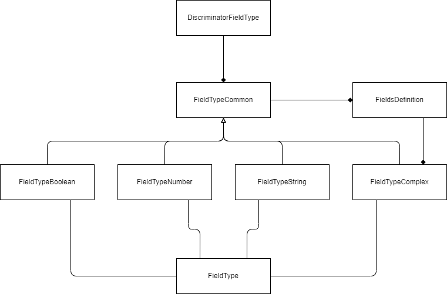

# Field types

`FieldTypes` are a essential part of `ContentTypeComplex`. `FieldTypes` are used to define the fields and build to whole content structure for a `ContentType`.

## Basic idea

Every `FieldType` must implement `FieldTypeCommon`. `FieldTypeCommon` provides basic features:

* `type`: Defines the type of this content. Must be set. Provided as `DiscriminatorFieldType`
* `optional`: Optional field defining if this field is optional.
* `hidden`: Optional field defining if this field is hidden
* `condition`: Optional field defining a function to check value of the field. Returns `Promise`

## Available `FieldTypes`

* `FieldTypeBoolean`
* `FieldTypeNumber`
* `FieldTypeString`
* `FieldTypeComplex`